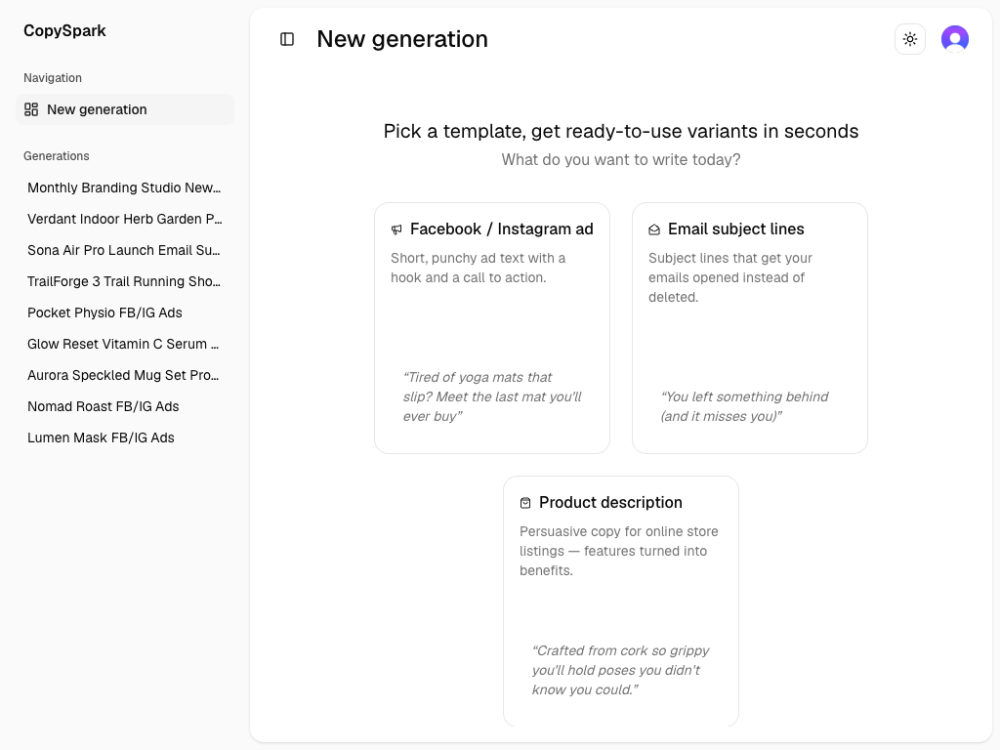
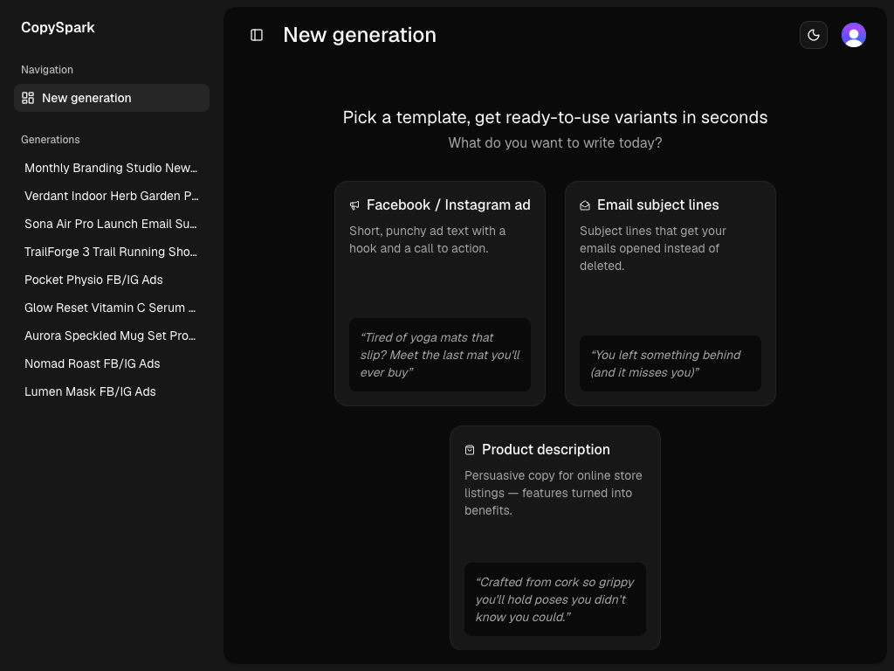
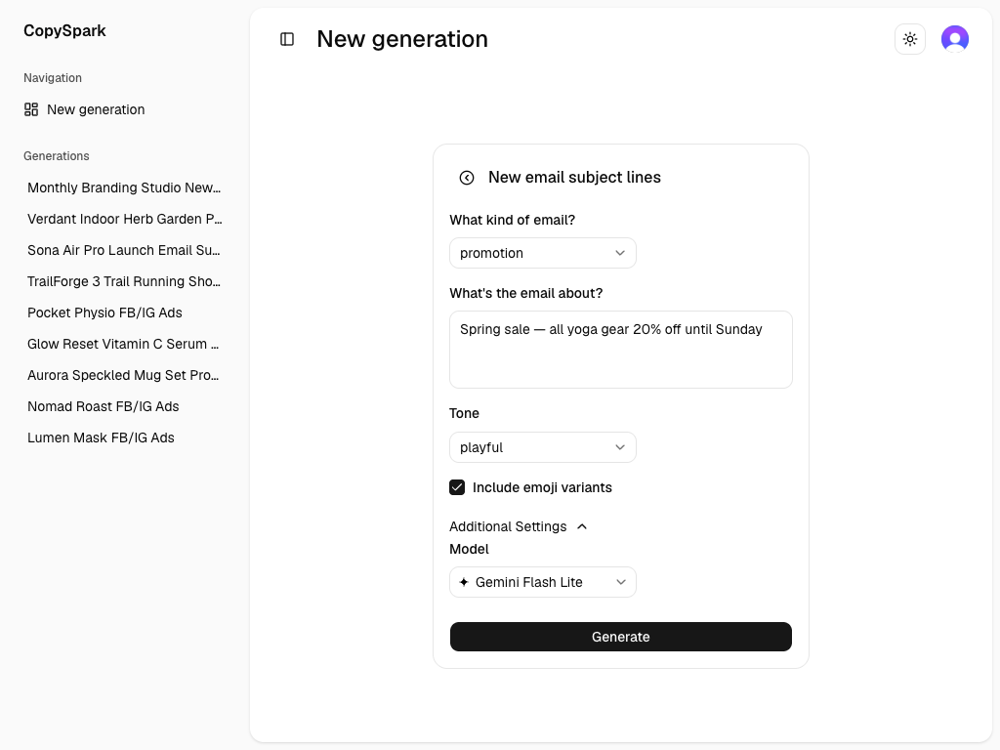
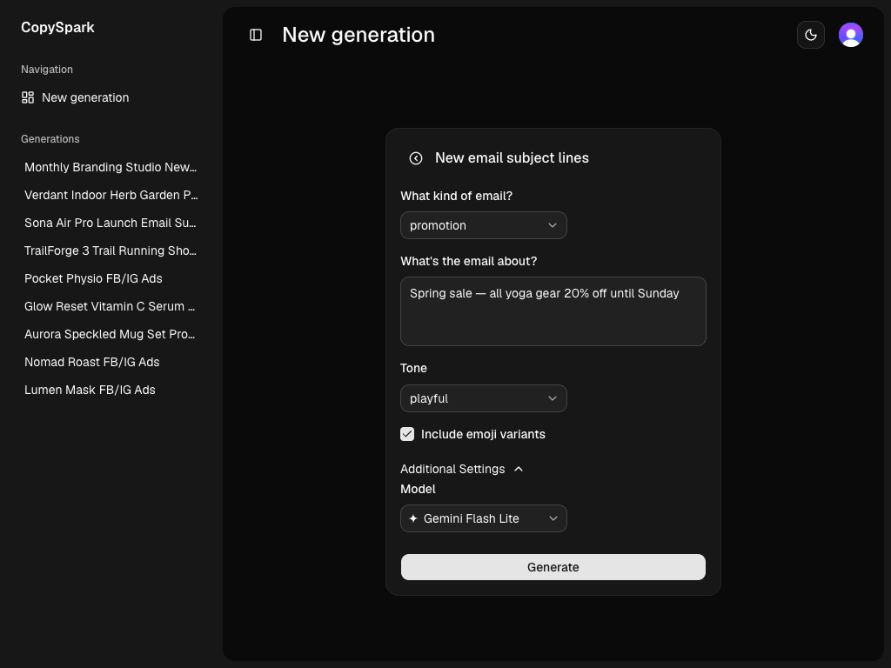
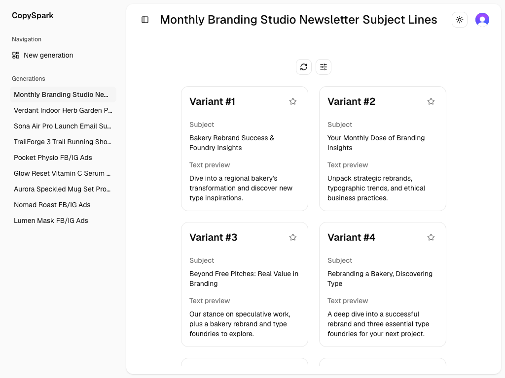
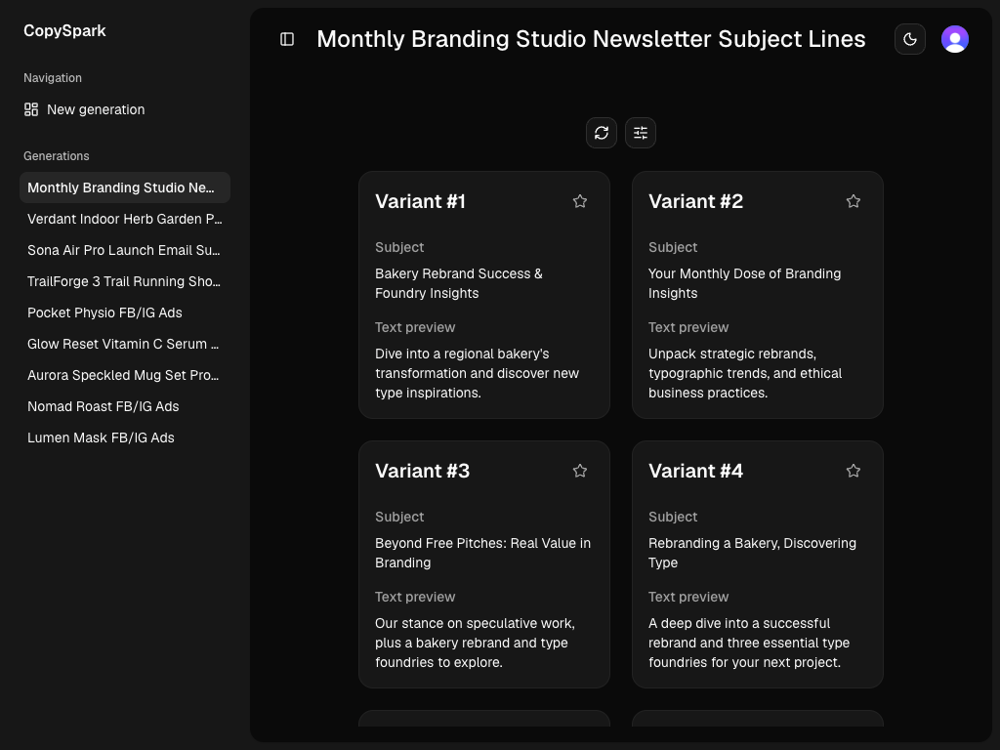

# Copy Spark

An AI marketing copy generator built on the [Vercel AI SDK](https://ai-sdk.dev).
Copy Spark turns a short brief about a product, audience, and tone into
ready-to-use marketing copy, streamed variant by variant.

**Live site:** https://copy-spark-198x.vercel.app/

Models are addressed as plain `provider/model` strings and routed through the
[Vercel AI Gateway](https://vercel.com/docs/ai-gateway) — Google, OpenAI,
Anthropic, Mistral, and Amazon models are selectable per generation (see
`src/constants/model.ts`).

## Features

- Three templates: Facebook / Instagram ad, email subject lines, product
  description (`src/constants/templates.ts`).
- Structured streaming — each generation returns a title plus an array of
  typed variants, validated with Zod on both ends.
- Pick a favorite variant, rename, edit the brief and regenerate, or stop a
  run mid-stream.
- Generation history persisted per Clerk user, with status tracking
  (`PENDING` / `STREAMING` / `COMPLETED` / `ERROR`).
- Light/dark theme.

## Screenshots

| Light                                                                           | Dark                                                                          |
| ------------------------------------------------------------------------------- | ----------------------------------------------------------------------------- |
|      |      |
|  |  |
|       |       |

## Stack

- [Next.js](https://nextjs.org) 16.2.4 — App Router
- [React](https://react.dev) 19.2.4
- [AI SDK](https://ai-sdk.dev) (`ai`) 7 · `@ai-sdk/react` 4
- [TanStack Query](https://tanstack.com/query) 5 — client data fetching
- [Prisma](https://www.prisma.io) 7 with `@prisma/adapter-pg` + `pg` — Postgres
- [Clerk](https://clerk.com) 7 — authentication
- [Tailwind CSS](https://tailwindcss.com) 4
- [shadcn/ui](https://ui.shadcn.com) 4 on [Base UI](https://base-ui.com) (`@base-ui/react`)
- [Zod](https://zod.dev) 4
- [TypeScript](https://www.typescriptlang.org) 5

## Getting Started

**Prerequisites:** Node.js 20.9+, [pnpm](https://pnpm.io), a Postgres database, a
[Clerk](https://clerk.com) application, and an
[AI Gateway API key](https://vercel.com/docs/ai-gateway).

```bash
git clone git@github.com:StarDust198/copy-spark.git copy-spark
cd copy-spark
pnpm install
```

Create your environment files with the following variables. `DIRECT_URL` has to
live in `.env` — `prisma.config.ts` loads only that file via `dotenv`. The rest
of the split is convention: Next.js reads both files (`.env.local` wins on
conflicts), and keeping the database URLs in `.env` puts them out of reach of
`vercel env pull`, which overwrites `.env.local`.

`.env`

```bash
DATABASE_URL=          # Postgres connection (pooled) — used by the app
DIRECT_URL=            # Postgres connection (direct) — used for migrations
```

`.env.local`

```bash
AI_GATEWAY_API_KEY=    # not needed if you run `vercel env pull` / deploy on
                       # Vercel — OIDC auth is used instead
NEXT_PUBLIC_CLERK_PUBLISHABLE_KEY=
CLERK_SECRET_KEY=
NEXT_PUBLIC_CLERK_SIGN_IN_URL=/signin
NEXT_PUBLIC_CLERK_SIGN_UP_URL=/signup
NEXT_PUBLIC_CLERK_SIGN_IN_FALLBACK_REDIRECT_URL=/new
NEXT_PUBLIC_CLERK_SIGN_UP_FALLBACK_REDIRECT_URL=/new
```

Apply the database schema and start the dev server:

```bash
pnpm prisma migrate dev
pnpm dev
```

Other scripts: `pnpm build`, `pnpm start`, `pnpm lint`.

## Folder structure

- `src`
  - `app` — App Router: `(public)` (sign-in/sign-up), `(private)` (`new` —
    template picker plus the per-template form at `new/[templateId]`, and
    `generation` — history), and `api/generate/[templateId]`.
    The root `page.tsx` currently just redirects to `/signin` — a public
    landing page is coming.
  - `components` — `ui` (shadcn on Base UI), plus `generation`, `forms`,
    `fields`, `layout`, and `themes`.
  - `lib`
    - `actions` — server actions: the three per-template `create*Generation`
      entry points plus update / get / delete, each scoped to the Clerk user.
    - `db` — the only place Prisma is called; every query takes a `userId`
      so ownership is enforced in one layer.
    - `query` — TanStack Query client, query options, and the mutation hooks
      the forms and generation UI use.
    - `prompts.ts` — system prompt, the tone / length / email-goal fragments,
      and a per-template prompt builder that safe-parses its input.
    - `prisma.ts` — Prisma client singleton on `@prisma/adapter-pg`.
    - `cn.ts` — `clsx` + `tailwind-merge` class helper.
    - `capitalize-first-letter.ts` — template titles are stored in their
      mid-sentence form, so standalone headings raise the first letter.
  - `schemas`, `constants`, `hooks`, `styles`.
  - `proxy.ts` — Clerk middleware.
- `prisma` — schema and migrations. `Generation.input` / `Generation.output`
  are `Json` columns rather than per-template tables — a deliberate v1 choice,
  since every template has a different shape.

## License

MIT © Sergey Zhilinsky — see [LICENSE](LICENSE).
